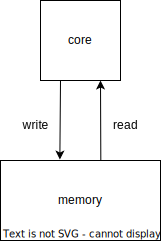
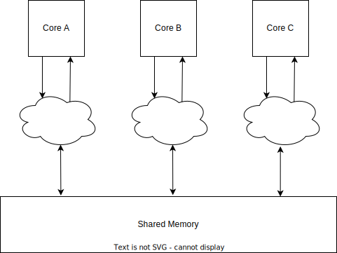
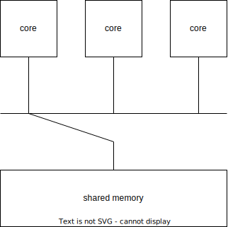
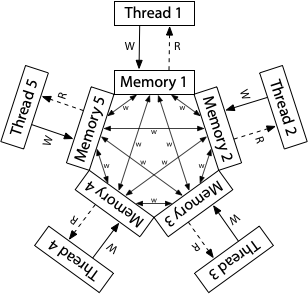
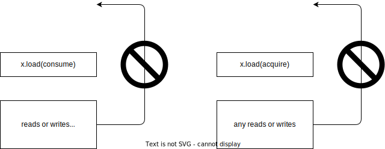

# C++ 中的内存序

[toc]

```
v2
created, 2024-06-29T11:08+08:00
published, 2024-11-15T17:41+08:00
modified, 2025-06-02T16:17+08:00, 添加豆包解析链接
category: c-cpp
```

## 单核访存模型

最早的时候，处理器只有单核（single core processor），编译器可以重排线程的代码，core 通过多发射同时执行多条指令。
比如同时执行两条 store 指令，其中一条的 store 可能更快地执行完。

这些指令重排与指令并行的优化对于单线程程序是有效的，因为它不影响程序的 output。

```c
int a = x;
int b = y;

printf("a: %d\n", a);
printf("b: %d\n", b);
```

比如上面的程序，汇编指令中 `load a`、`load b` 无论谁先完成都无所谓，只需要最后 printf 是按顺序的就好了。



单核处理器看起来就像每次执行一条指令，store 总是写入到 memory 后，才可以执行下一条指令。

## 多核访存模型 与 sequentially consistency



多核处理器时代就改变了这一切，

1. 编译器可能重排代码
2. 一个线程可能执行顺序会因为多发射导致执行顺序不确定
3. 多个核心之间有自己的 cache，需要协议进行同步

最松散的内存模型如下：

1. 一个 core 对内存的写入，其他 core 需要一段时间 load 才能读取到该值
2. 一个 core 写入内存后，不同的 core 可能需要经过不同的时间后 load 才能读取到该值

这样的内存模型就非常松散，考虑下面的程序[^1]，

```c
// program: if-done-print-x

int x = 0, done = 0 // global

// Thread 1           // Thread 2
x = 1;                while(done == 0) { /* loop */ }
done = 1;             print(x);
```

t1 因为指令并行，导致内存中 done 写入 1，并且在极短的时间内，其他线程就得知了 done 被修改
t2 得知 done 为 1 后，就要读取 x，
此时 `x=1` 可能因为还在执行，所以 t2 print 0；
也可能 `x=1` 已经写入到内存，但是需要过很长的时间，才能被其他线程得知，所以 t2 还是 print 0

这就和程序员看到的代码不一样了，程序员本来希望有一种最严格的内存模型，符合如下规则：

1. read、write、rmw（read-modify-write 如 CAS）都是原子性的，不可分割，
2. 单线程内，所有的 read、write、rmw 都是顺序执行。后面的指令总是要等待前面的指令完成才可以执行
3. 每次只能有一个线程访存
4. 线程对内存的写入立刻对其他线程可见。比如 Thread A 执行 x=1 写入完成后，Thread B 读取 x 必然为 1，不需要任何等待。



[Wikipedia](https://en.wikipedia.org/wiki/Sequential_consistency#) 将其归结为 线程内部的指令是 sequence，以及 global 指令执行也是 sequence。

这样的话，就可以保证上述 if-done-print-x 程序总是可以 print 1。

## x86-TSO(x86 Total Store Order)

本部分来自 https://research.swtch.com/hwmm#x86

作者写得非常清楚，可惜是英语，有些东西用中文表达起来本就拗口，用英文就更乱了。


x86-TSO 的内存模型约束如下：

1. 每个 thread 的写入先写入一个自己的 write-queue
2. 每个 thread 读取先查看自己的 write-queue，找不到就看内存
3. 每个 thread 无法得知其他 thread 的 write-queue 内容
4. 所有 thread 的 write queue 对 memory 的写入是 sequence 且 原子的。

### none-sequential write-read

用 xyz 变量表示写内存，用 r1, r2 表示 thread 内部寄存器

下面测试展示了 TSO 和 sequentially consistent memory model 的区别：

Litmus Test: Write Queue (also called Store Buffer)
Can this program see r1 = 0, r2 = 0?

```c
// Thread 1         // Thread 2
x = 1               y = 1
r1 = y              r2 = x
```

On sequentially consistent hardware: no.
On x86 (or other TSO): yes!

对于先 write 后 read 指令，read 没法保证前面的 store 写入了内存，这导致 Dekker 互斥算法等其他算法失效。

所以需要 memory barrier 来保证 write-queue 被 flush 到内存上，就像：

```c
x = 1
memory barrier
r1 = y
```

### total order

意思是，一个 core 写入内存后，立刻对其他所有 core 可见。
也就是说，core1 执行 `x = 1` 写入 memory 后，core2 执行 `x=2`，其他所有 core 都将观测到 先 x=1，然后 x=2，
不会观测到 先 x=2，后 x=1。

这叫做 coherence。

coherence 是对最松散的内存模型的一种约束，它要求不同 thread 的写入，在其他线程看来一定要有一个确定的顺序，否则很难编程。

## ARM/POWER Relaxed Memory Model

参考 https://research.swtch.com/hwmm#relaxed



## none-sequential write-write

Litmus Test: Message Passing
Can this program see r1 = 1, r2 = 0?

```c
// Thread 1           // Thread 2
x = 1                 r1 = y
y = 1                 r2 = x
```

On sequentially consistent hardware: no.
On x86 (or other TSO): no.
On ARM/POWER: yes!

ARM 架构中，x、y 的写入没有到 write-queue，而是直接到 cache，过一段时间其他线程才会看到，
x 和 y 传播到其他 cache 需要的时间是不同的（但是因为 coherence 要求，所有 thread 都会看到一个统一的写入顺序）

## DRF

https://research.swtch.com/hwmm#drf

我的理解：

DRF 说，我们除了 read 和 write，再定义一种同步原语吧，
同步原语前的的 read 或者 write 一定完成，并且同步可以被不同的线程所知晓。


## Acquire-Release 得名

> In many multi-threaded algorithms, a thread writes some data and then writes to a flag that tells other threads that the data is ready.
> This is known as a write-release.
> If the writes are reordered, other threads may see that the flag is set before they can see the written data.
>
> Similarly, in many cases, a thread reads from a flag and then reads some shared data if the flag says that the thread has acquired access to the shared data.
> This is known as a read-acquire.
> If reads are reordered, then the data may be read from shared storage before the flag, and the values seen might not be up to date.
>
> https://learn.microsoft.com/en-us/windows/win32/dxtecharts/lockless-programming#reordering

所以我们需要两种机制：

1. 保证一条 write 前的操作都执行完，再 write，
2. 保证 read 先执行完，再执行 read 后面的指令

对于机制 1，就是前文提到的 memory barrier，将值 write 前的指令都 flush 到内存中
对于机制 2，就是防止 read 重排

一个需要 read-require 和 load-release 的例子[^2]：

```cpp
#include <atomic>
#include <thread>
#include <iostream>

std::atomic<bool> ready(false);
int data = 0;

// 生产者线程
void producer() {
    data = 42;                     // 步骤1：写入数据
    ready.store(true, std::memory_order_release);  // 步骤2：发布数据（store-release）
}

// 消费者线程
void consumer() {
    while (!ready.load(std::memory_order_acquire));  // 步骤3：等待数据（load-acquire）
    std::cout << data << std::endl;  // 步骤4：读取数据
}

int main() {
    std::thread t1(producer);
    std::thread t2(consumer);
    t1.join();
    t2.join();
    return 0;
}
```

消费者线程需要保证 ready 后，再从内存中读取 data，否则可能导致读取到 data 的旧值。
从 CPU 的视角上看，可能的情况是多个核心各有 cache，消费者读取到了旧 cache。

## C++11 的内存序

### relax

relax：最松散的内存序，就是最松散的内存模型，只保证原子性写入，甚至不保证 coherence。

```c
// Thread 1:
r1 = y.load(std::memory_order_relaxed); // A
x.store(r1, std::memory_order_relaxed); // B

// Thread 2:
r2 = x.load(std::memory_order_relaxed); // C
y.store(42, std::memory_order_relaxed); // D
```

结果可能是 r1 = r2 = 42，因为 D 被重排到了 C 前面，执行顺序为 `D->A->B->C`

如果只有一条 atomic 操作，那 relax 内存序没啥用，
比如自增的 counter，用在 `shared_ptr` 中引用计数自增

```cpp
// int x = 0;
atomic_int x = 0;

// the number added to x must be big enough to show data race
// if the number is 10, thread1 executes so very fast that thread 2 even haven't been launched
void add_1000000()
{
    for (int i = 0; i < 1000000; ++i)
    {
        x += 1;
    }
}

int main()
{
    thread th1(add_1000000);
    thread th2(add_1000000);
    th1.join();
    th2.join();
    std::cout << x << std::endl; // 2000000 or smaller if not atomic
    return 0;
}
```

### release/acquire/consume

release 保证前面的读写都完成，就像把 cache 中的值 flush 到内存中。


acquire 保证读取指令完成后，再执行后面的指令，release-acquire 就构成了 synchronize-with。

> Synchronizes with
>
> If an atomic store in thread A is a release operation,
> an atomic load in thread B from the same variable is an acquire operation,
> and the load in thread B reads a value written by the store in thread A,
> then the store in thread A synchronizes-with the load in thread B.
>
> Also, some library calls may be defined to synchronize-with other library calls on other threads.
> [std::memory_order \- cppreference\.com](https://en.cppreference.com/w/cpp/atomic/memory_order#Relaxed_ordering)

consume 较于 acquire 更加松散，只禁止后面依赖于其 load 的值的指令重排到其前面。



### acq-rel

给 RMW 用的，比如 `atomic_int.fetch_add(int val)`，既充当 release，也充当 acquire。

### seq-cst

> A load operation with this memory order performs an acquire operation,
> a store performs a release operation,
> and read-modify-write performs both an acquire operation and a release operation,
> plus a single total order exists in which all threads observe all modifications in the same order (see Sequentially-consistent ordering below).
> [std::memory_order \- cppreference\.com](https://en.cppreference.com/w/cpp/atomic/memory_order#Relaxed_ordering)

最严格的内存模型，禁止周围指令重排，我觉得最后一句话没有必要，如果不这么做，就违背了 coherence。
不过 cpp reference 自己形式化定义了所有的名词，所以可能在它的语境下，最后一句话是有必要的。

## volatile 不能保证多线程的同步

[Item 40:对于并发使用 std::atomic，volatile 用于特殊内存区 \- Effective Modern C\+\+](https://cntransgroup.github.io/EffectiveModernCppChinese/7.TheConcurrencyAPI/item40.html)

volatile 应该用于 special 内存。

volatile 看起来好像可以实现线程之间的同步：

```cpp
int x = 0;
/* volatile */ int flag = 0; // whether x has been written

void thread1_write_x() {
    x = 100;
    flag = 1;
}

void thread2_read_x() {
    while (flag == 0) ; // spin

    // we want to see x equals 100, but it may:
    // 1. x equals 0 because of the reorder for write_x
    // 2. never execute to this line because of the optimization
    std::cout << x << std::endl;
}

int main() {
    thread t2(thread2_read_x);
    thread t1(thread1_write_x);
    t1.join();
    t2.join();
    return 0;
}
```

如果不使用 volatile，spin 那一行代码可能会被优化为只读取一次到寄存器里，导致 thread2 一直 spin：

```asm
load r0 flag
while (not r0) ;
```

使用了 volatile，每一次 read flag 都会重新从内存中读取一遍，编译器不会将多次 read 优化为一次：

```
READ:
    load r0 flag
    while (not r0)
    goto READ
```

所以 volatile 看起来实现了两个线程间的同步，但是并不能实现原子性，因为 thread1 可能由于编译器重排或者 CPU 乱序执行导致 `flag=1` 先于 `x=100`:

实际执行顺序：

```asm
flag = 1
x = 100
```

[^1]: [research\!rsc: Hardware Memory Models \(Memory Models, Part 1\)](https://research.swtch.com/hwmm#introduction)
[^2]: https://www.doubao.com/thread/wb57c7b2074000950
