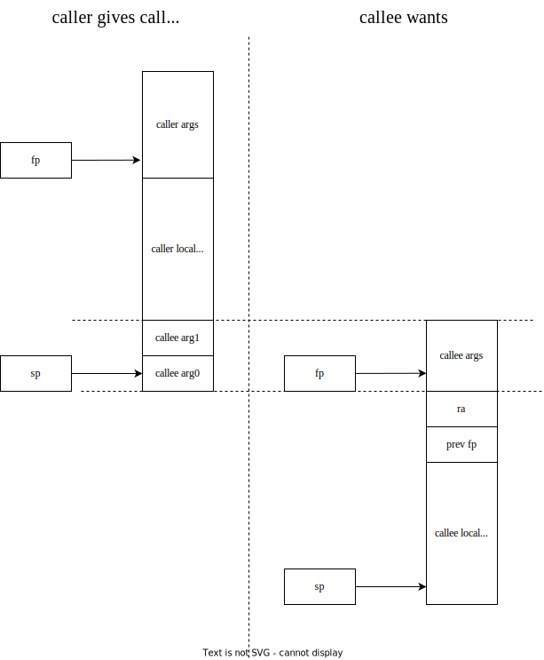
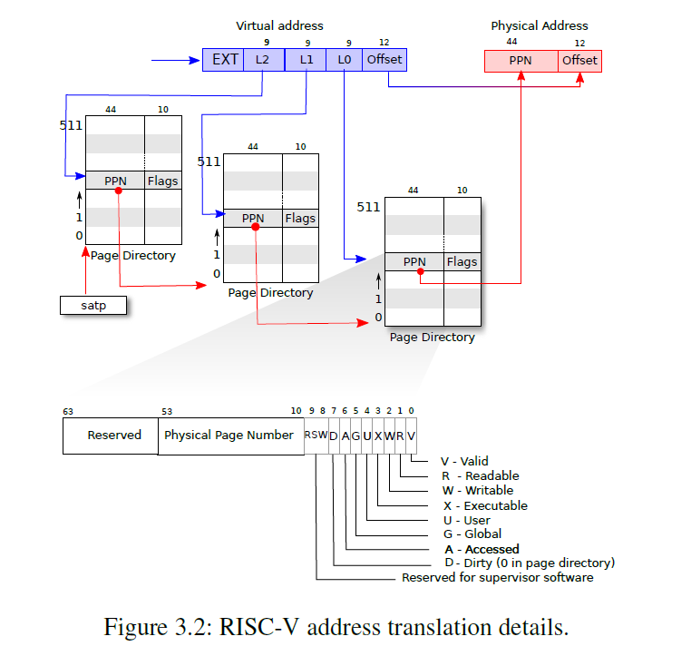
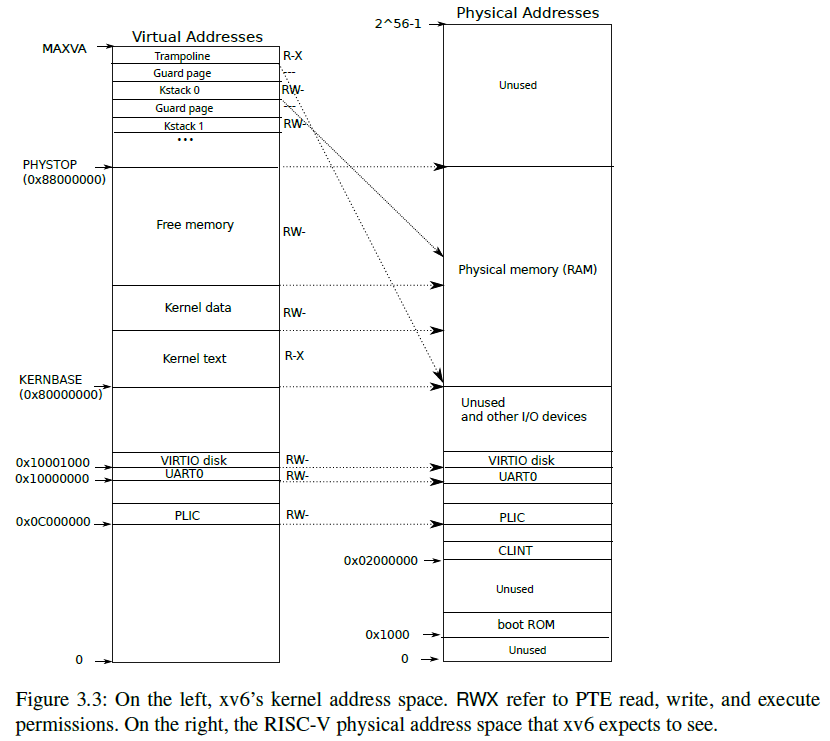
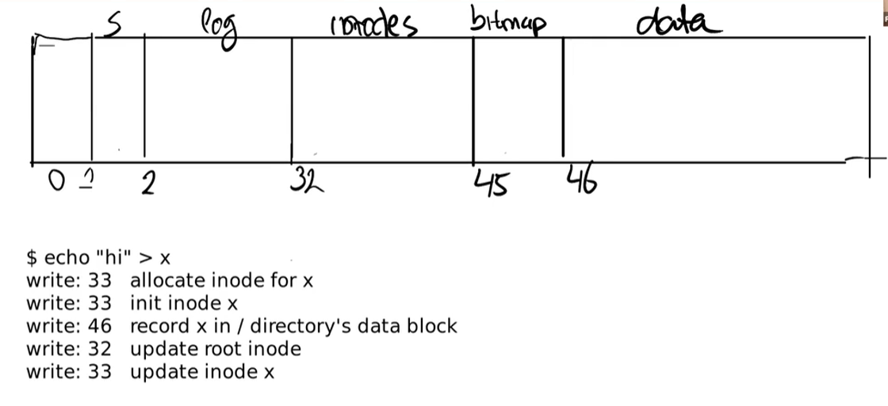
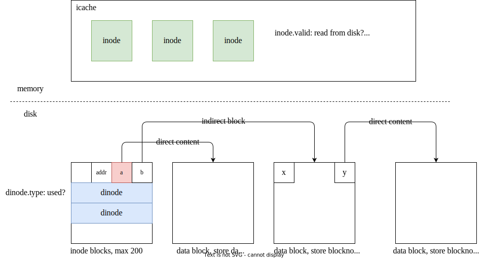

# xv6 代码执行流分析

```
v2
created, 2024-01-08T19:56+08:00
published, 2024-04-16T10:10+08:00
category: operating-system
```

基于 `git://g.csail.mit.edu/xv6-labs-2020` 代码
前置知识：编译原理，计算机组成

[poe.com](poe.com)：一个 gpt 网站
一个方便的在线查看汇编网站：[Compiler Explorer](https://godbolt.org/)

[TOC]

# calling convention

[函数调用约定中寄存器的保存问题](https://www.cnblogs.com/ticlab/p/18103119)

程序执行的底层就是 pc，ra，fp、sp，instruction memory 和 data memory。

pc 指向 instruction memory，没有跳转指令就在下一个时钟周期 `pc +=4` 指向下一条指令。

fp 和 sp 索引 data memory，为函数执行提供变量，通过 ra 支持函数调用。



# 链接：`ld -T kernel.ld *.o -o kernel`

Makefile 中有：

```
$K/kernel: $(OBJS) $(OBJS_KCSAN) $K/kernel.ld $U/initcode
	$(LD) $(LDFLAGS) -T $K/kernel.ld -o $K/kernel $(OBJS) $(OBJS_KCSAN)
	$(OBJDUMP) -S $K/kernel > $K/kernel.asm
	$(OBJDUMP) -t $K/kernel | sed '1,/SYMBOL TABLE/d; s/ .* / /; /^$$/d' > $K/kernel.sym
```

看第 2 行，意思是，调用 `ld`，根据 `kernel.ld` 这个文件的要求，把所有 `.o` 链接为 `kernel` 文件。


根据汇编语言的知识，我们知道每个 `.o` 文件里有 `.data` `.text` 等 section，linker 把这些 `.o` 文件拼一起到，链接成为 `kernel` 这个新的 elf 文件。在 `kernel` 中，原来 `*o` 中多个 section 组合为 segment，每个 segment 都会有对应的加载地址。当 loader 要把 `kernel` 加载到内存中时，会依据每个 segment 要求的地址，加载到对应的位置。

参考阅读 「ELF 文件的链接与加载」：[博客园地址](https://www.cnblogs.com/dutrmp19/p/18280144) | [GitHub 相对地址](../elf-linker-loader/elf-linker-loader.md)

`ENTRY(_entry)` 在要求`*.o`中 `_entry` 这个符号，链接后放到 `kernel` 的开始，并且 load 后 `_entry` 要在物理地址 `0x8000_0000` 上，也就是 2GB 的位置，这个符号叫做 `_entry` 是因为 qemu load 以后，会把 pc 指向这里。

`kernel.ld` 还定义了合并、地址对齐的规则。

比如 `*.o/.text` 和 `*.o/.text.*` 这些要合并到 `kernel` 的 `.text` 中

`PROVIDE` 是向外导出符号

```ld
OUTPUT_ARCH( "riscv" )
ENTRY( _entry )

SECTIONS
{
  /*
   * ensure that entry.S / _entry is at 0x80000000,
   * where qemu's -kernel jumps.
   */
  . = 0x80000000;

  .text : {
    *(.text .text.*)
    . = ALIGN(0x1000);
    _trampoline = .;
    *(trampsec)
    . = ALIGN(0x1000);
    ASSERT(. - _trampoline == 0x1000, "error: trampoline larger than one page");
    PROVIDE(etext = .);
  }

  .rodata : {
    . = ALIGN(16);
    *(.srodata .srodata.*) /* do not need to distinguish this from .rodata */
    . = ALIGN(16);
    *(.rodata .rodata.*)
  }

  .data : {
    . = ALIGN(16);
    *(.sdata .sdata.*) /* do not need to distinguish this from .data */
    . = ALIGN(16);
    *(.data .data.*)
  }

  .bss : {
    . = ALIGN(16);
    *(.sbss .sbss.*) /* do not need to distinguish this from .bss */
    . = ALIGN(16);
    *(.bss .bss.*)
  }

  PROVIDE(end = .);
}
```

## `kernel.ld` explained by GPT

这是一个示例的 `kernel.ld` 文件，用于控制内核的链接过程和内存布局。下面逐行解释每个部分的含义：

1. `OUTPUT_ARCH( "riscv" )`: 指定输出文件的体系结构为 RISC-V。
2. `ENTRY( _entry )`: 指定入口点为 `_entry`，即内核的启动函数。
3. `SECTIONS`: 开始定义节（Sections）。
4. `. = 0x80000000;`: 将当前位置设置为内存地址 0x80000000，确保 `entry.S` 文件中的 `_entry` 函数位于该地址处，以便与 QEMU 的 `-kernel` 选项兼容。
5. `.text` 节：定义代码段。

    - `*(.text .text.*)`：将所有以 `.text` 或 `.text.` 开头的段合并到这个节中。
    - `. = ALIGN(0x1000);`：将当前位置对齐到 0x1000（4096）字节的边界。
    - `_trampoline = .;`：将 `_trampoline` 符号设置为当前位置。
    - `*(trampsec)`：将 `trampsec` 段的内容合并到这个节中。
    - `. = ALIGN(0x1000);`：将当前位置对齐到 0x1000 字节的边界。
    - `ASSERT(. - _trampoline == 0x1000, "error: trampoline larger than one page");`：断言 `_trampoline` 到当前位置的大小为 0x1000 字节，如果不满足则给出错误提示。
    - `PROVIDE(etext = .);`：定义 `etext` 符号为当前位置。

6. `.rodata` 节：定义只读数据段。

    - `. = ALIGN(16);`：将当前位置对齐到 16 字节的边界。
    - `*(.srodata .srodata.*)`：将所有以 `.srodata` 或 `.srodata.` 开头的段合并到这个节中。
    - `. = ALIGN(16);`：将当前位置对齐到 16 字节的边界。
    - `*(.rodata .rodata.*)`：将所有以 `.rodata` 或 `.rodata.` 开头的段合并到这个节中。

7. `.data` 节：定义数据段。

    - `. = ALIGN(16);`：将当前位置对齐到 16 字节的边界。
    - `*(.sdata .sdata.*)`：将所有以 `.sdata` 或 `.sdata.` 开头的段合并到这个节中。
    - `. = ALIGN(16);`：将当前位置对齐到 16 字节的边界。
    - `*(.data .data.*)`：将所有以 `.data` 或 `.data.` 开头的段合并到这个节中。

8. `.bss` 节：定义未初始化数据段。

    - `. = ALIGN(16);`：将当前位置对齐到 16 字节的边界。
    - `*(.sbss .sbss.*)`：将所有以 `.sbss` 或 `.sbss.` 开头的段合并到这个节中。
    - `. = ALIGN(16);`：将当前位置对齐到 16 字节的边界。
    - `*(.bss .bss.*)`：将所有以 `.bss` 或 `.bss.` 开头的段合并到这个节中。

9. `PROVIDE(end = .);`：定义 `end` 符号为当前位置，表示内核的结束位置。

以上是这个示例 `kernel.ld` 文件的逐行解释。通过修改这个链接器脚本，可以自定义内核的内存布局和链接过程，以适应特定的需求和目标平台。

## load kernel: set stack, jump to main

qemu 把 `kernel` 加载到内存中后，所有 CPU 的 pc 指向 `entry.S/_entry`

entry 作用就是设置每个 CPU 中 `$sp` 的值，这样每个 core 都有自己的栈，可以开始执行代码了。

```c
// main.c

// entry.S needs one stack per CPU.
__attribute__ ((aligned (16))) char stack0[4096 * NCPU];
```

```assembly
# Entry.S

_entry:
	# set up a stack for C.
        # stack0 is declared in start.c,
        # with a 4096-byte stack per CPU.
        # sp = stack0 + (hartid * 4096)
        la sp, stack0
        li a0, 1024*4
	csrr a1, mhartid
        addi a1, a1, 1
        mul a0, a0, a1
        add sp, sp, a0
	# jump to start() in start.c
        call start
spin:
        j spin
```


1. `entry.S` 设置了 sp(kernel stack pointer) 为 `stack0 + cpu# * 4096`，
   stack0 地址暴露于 start.c，编译到 start.o 的全局变量中，这个地址就在 0x8000_0000 上面的 kernel.o 中，每个 CPU 都有一页的空间，用来作为进程还没起来之前的调用栈。
   （注意每个进程都有自己的 kstack，不要和这个 stack0 混淆）
   在结尾 call `start.c/start()`
2. `start()` 本身没有函数参数，所以 sp 指向的位置上没有任何值，这也符合 calling convention
3. `start()` 结尾 `w_mepc main`，通过 mret 调用 main
4. `main.c/main()` 开始各种初始化并创造第一个进程

```c
// start() jumps here in supervisor mode on all CPUs.
void
main()
{
  if(cpuid() == 0){
    consoleinit();
#if defined(LAB_PGTBL) || defined(LAB_LOCK)
    statsinit();
#endif
    printfinit();
    printf("\n");
    printf("xv6 kernel is booting\n");
    printf("\n");
    kinit();         // physical page allocator
    kvminit();       // create kernel page table
    kvminithart();   // turn on paging
    procinit();      // process table
    trapinit();      // trap vectors
    trapinithart();  // install kernel trap vector
    plicinit();      // set up interrupt controller
    plicinithart();  // ask PLIC for device interrupts
    binit();         // buffer cache
    iinit();         // inode cache
    fileinit();      // file table
    virtio_disk_init(); // emulated hard disk
#ifdef LAB_NET
    pci_init();
    sockinit();
#endif
    userinit();      // first user process
#ifdef KCSAN
    kcsaninit();
#endif
    __sync_synchronize();
    started = 1;
  } else {
    while(lockfree_read4((int *) &started) == 0)
      ;
    __sync_synchronize();
    printf("hart %d starting\n", cpuid());
    kvminithart();    // turn on paging
    trapinithart();   // install kernel trap vector
    plicinithart();   // ask PLIC for device interrupts
  }

  scheduler();
}
```

# 内核页表设置

可以启动 qemu debug，查看各个变量的值，参考 `memlayout.h`。

现在我们有一个被加载到内存中的 kernel，pc 指向了这个 kernel 的 `.text`。

kernel 做的第一件事就是把所有空闲物理页面管理起来

## kinit: 串联所有空闲物理页面

`main.c/main` 中的 `kinit()`使用头插法，将 end 到 PHSYTOP 之间的 page 串起来，freelist 恰好指向最后一个 page。一个 page size 是 4096 bytes，也就是 `0x0000_1000`

```bash
p kmem
$3 = {
    lock = {locked = 0, name = 0x80008068 "kmem", cpu = 0x0},
    freelist = 0x87fff000
}

p end # in kernel.ld
$4 = 0x80026000 ""
```


从此以后，可以使用 kalloc 和 kfree 来分配与释放物理页。

## RISCV 寻址机制

给定虚拟地址，RISCV 是如何取出地址上存储的 byte？

### 什么是地址？

在介绍代码前，需要知道「地址」是什么东西。

比如 32 位处理器，就好像内存上有 $2^{32}$ 个小房间，每个小房间里都住着一个 byte，总共可以管理 4GB。 64 位处理器，就可以管理 $2^{64}$ 个 byte。32 、64 也体现在 C 语言中指针的长度是 32 bit 还是 64 bit。

操作系统把这么大的内存划分为一个个 page，一个 page 是 4096 bytes，$4096 = 2^{12}$，所以地址的低 12 位就是用来索引 page 中的一个 byte，前 20 位用来找到是哪一个 page。

xv6 是 64 bits 操作系统，一个指针大小为 8 bytes。

> 可以通过 `ptype` 来查看结构体占据的大小：
>
> ```bash
> b kvminit
> c
> ptype /o struct run
>
> (gdb) ptype /o struct run
> /* offset      |    size */  type = struct run {
> /*      0      |       8 */    struct run *next;
>
>                          /* total size (bytes):    8 */
>                        }
> ```
>
> 可以验证一个指针大小为 8 bytes。

### RISCV 寻址机制

riscv 通过 `satp` 记录根目录的物理地址，给一个 virtual address，MMU 从 virtual address 中拆出 PPN 在每一级页表的索引。



与之对应，如果我们想要让 va 索引到 pa，就需要自己先从 va 中取出 L2，检查 satp 指向的 pagetable 中 L2 处的 64 个 bits，我们称之为 `page table entry(PTE)`。如果 entry flags 是无效的，就要分配一物理页，将 entry 中 PPN 修改为物理页地址，再从 va 中取出 L1，重复上述过程。

1. 一个 PTE 大小为 8 个 bytes，一个 page 大小为 4096 个 bytes，所以一个 page 里面可以存放 512 个 PTE
2. 通过虚拟地址 L0 字段找到 page 512 个 PTE 的第几个
3. PTE 里面存放的是真实的物理地址，通过这个物理地址找到一个新的、存放 PTE 的 page，再利用 va 的 L1 字段找到对应的 PTE

## kvminit: 为内核建立内存映射

下面是需要建立的映射：



给定 va 和 satp 如何建立映射呢？

首先通过 va 的 L2，L1 和 L0，通过 `vm.c/walk` 找到对应的 PTE，在 walk 过程中，如果一个 PTE 中 valid 是无效的，说明没有建立页表，就通过 kinit 已经为我们建立好的 free memory 管理机制，申请一个新的 page，把这个 page 的 pa（物理地址）写入 PTE。

```c
// Return the address of the PTE in page table pagetable
// that corresponds to virtual address va.  If alloc!=0,
// create any required page-table pages.
//
// The risc-v Sv39 scheme has three levels of page-table
// pages. A page-table page contains 512 64-bit PTEs.
// A 64-bit virtual address is split into five fields:
//   39..63 -- must be zero.
//   30..38 -- 9 bits of level-2 index.
//   21..29 -- 9 bits of level-1 index.
//   12..20 -- 9 bits of level-0 index.
//    0..11 -- 12 bits of byte offset within the page.
pte_t *
walk(pagetable_t pagetable, uint64 va, int alloc)
{
  if(va >= MAXVA)
    panic("walk");

  for(int level = 2; level > 0; level--) {
    pte_t *pte = &pagetable[PX(level, va)];
    if(*pte & PTE_V) {
      pagetable = (pagetable_t)PTE2PA(*pte);
    } else {
      if(!alloc || (pagetable = (pde_t*)kalloc()) == 0)
        return 0;
      memset(pagetable, 0, PGSIZE);
      *pte = PA2PTE(pagetable) | PTE_V;
    }
  }
  return &pagetable[PX(0, va)];
}
```

walk 最后会返回 satp 根据 va 最后要访问的 PTE，将 pa 写入 PTE 即可建立 va 到 pa 的映射。

## 映射需要内存段并开启 MMU

因为有很多的 map，将 kernel mode 下的 va 和 pa 建立映射。

1. KERNEL BASE 到 PHYSTOP 之间的映射是一一映射。开启分页以后，访问 kernel data 中的变量通过虚拟地址还是在访问其物理地址，相当于不需要做转换。

2. trampoline 意思是「跳板」，user mode 到 kernel mode 后要运行的代码就存储在 trampoline.S 中，也就是位于 kernel text 中

    ```c
    // map the trampoline for trap entry/exit to
    // the highest virtual address in the kernel.
    kvmmap(kpgtbl, TRAMPOLINE, (uint64)trampoline, PGSIZE, PTE_R | PTE_X);
    ```

3. 每个进程进入 kernel mode 以后，pc 指向 trampoline.S，还需要运行的栈空间，就是 kstack0，kstack1 这些空间，让 sp 指向。

最后一步：`kvminithart();   // turn on paging`

在没有开启分页前，`$pc`、`load` 和 `store` 命令使用到的地址都是物理地址，
当建立好 pagetable 后、 `$satp` 中存储根页表地址并开启分页后，页表转换的任务就交给物理单元 MMU 了，
不再需要调用 `walkaddr()` 来获取一个 va 的 pa，MMU 作为物理单元直接获取，TLB 则是 MMU 的 cache。

## 内存管理总结

目前为止，就内存而言，我们做了这些：

1. linker 把 kernel 的 data、text 等放到内存的对应位置，每个 cpu 的 pc 指向 entry，sp 指向 可 kernel data 中的某段 stack
2. 将 free memory 用 free list 组织起来
3. 使用 free memory 中的 pages 建立页表，映射包括
    1. kernel base 到 phystop 的直接映射
    2. TRAMPOLINE 这个 va 到 trampoline.S 的 .text 段
    3. 每个 proc 进入 kernel mode 的 kstack

# trap 机制

我们先不讨论 xv6 是如何启动第一个用户进程的，
而先介绍进程是如何在 user mode 和 kernel mode 之间转换。

我们知道当一下三种情况发生后，进程会从 user mode 切换到 kernel mode，我们统称为「trap」：

1. 发生异常，比如除以零`int x = 5 / 0;` 或者访问无效内存 `int x = *((int*)(0x0));`
2. 被中断，比如时钟中断触发进程调度
3. 进程主动 syscall

trap 发生时，进程原来的执行流就被打断，需要硬件和软件层面达成约定，比如 pc 应该跳转到哪里，stack 如何设置等。RISCV 的约定是：

1. pc 被存储到 epc，以便恢复
2. pc 被设置为 stvec，跳转到 stvec 指向的代码段开始执行
3. sscause 记录 trap 的原因，是 syscall，还是
4. 其他约定可以不管

下图表示跳转过程中，寄存器中存储的值的变化，红色表示代码，绿色表示数据。


# first process

暂时跳过 `trapinit()`，来到`main.c` 中的 `userinit()`

## process need a trapframe

一个进程从 user mode 到 kernel mode，CPU 里面还有很多 regs 是有内容的，突然要让 CPU 的 pc 指向 trampoline，sp 指向 kstack，寄存器里面原来的值就要保存下来，所以每个进程需要一个 trapframe 来保存进入前的寄存器的值。

粗略浏览代码：

1. `uservec` 很多都在保存 regs 到 trapframe，然后跳转到 `trap.c::usertrap()` 这个函数
2. `userret` 将 trapframe 中 regs 恢复，再返回原来的代码

## `allocproc()`: alloc process

`allocproc()`:

1. 分配 trapframe 页面
2. 建立页表，映射 TRAMPOLINE 到 trampoline.S
   发现 kernel mode 和 user mode 下 TRAMPOLINE 的映射是一样的
3. 映射 trapframe 在 TRAMPOLINE 下面
4. 设置 context ra 为 forkret，sp 为 kstack，此处作用之后再说

## uvminit

我们希望第一个程序看到：

```bash
sp -> PAGESIZE    -------------
                |            |
                |initcode    |
pc -> 0X0        -------------
```

放置 `proc.c::initcode` 代码到 free memory 中，并在 process 的 page table 中建立页面映射：user mode map 到 0x0 并且让 epc 指向这个 page，`trapframe.sp` 指向 pagesize。

initcode 是在 user mode 执行的，因为代码里面有 ecall，内容是发起一个系统调用：`exec("/init", {"init", 0})`，就好像自己写一个 `main(argc, argv)`，约定了命令行调用的第一个参数就是自己的名字。因为 initcode.S 中内容很少，几乎没有局部变量，所以 sp 直接设置为 pagesize 已经够用了。

我们已经伪造好了一个程序执行的 pc、sp，只要想办法从 kernel mode 切换到 user mode，把 pc 和 sp 设置正确，就可以运行第一个进程。

## `scheduler() > swtch()`

现在我们有一个箭在弦上的进程（trapframe 中记载了其 pc 和 sp），我们还处在内核态，CPU 的 pc 来到了 `schedule()`，其查找一个可用的进程，然后调用 `swtch()`，


<!--  -->

`context.sp=kernel_stack` 以及 `context.ra=forkret`，这样如果 proc 被选中，通过 swtch 直接执行内核的 forkret 函数，forkret 没有局部变量，所以不需要 stack frame

# trap

`forkret() > usertrapret() > userret()`

forkret 视作对 usertrapret 的封装，看起来好像从一个 trap 中返回了一样。

user 和 kernel mode 之间代码调用通过 TRAMPOLINE 连接，user mode 和 kernel mode 的 pc、pagetable、sp、regs 存储在 trapframe 中——**TRAMPOLINE 和 trapframe 分别是代码和数据的桥梁**。


```c
struct trapframe {
  /*   0 */ uint64 kernel_satp;   // kernel page table
  /*   8 */ uint64 kernel_sp;     // top of process's kernel stack
  /*  16 */ uint64 kernel_trap;   // usertrap()
  /*  24 */ uint64 epc;           // saved user program counter
  /*  32 */ uint64 kernel_hartid; // saved kernel tp
  // ... 31 registers, because no $pc, use epc
}
```

进入 trap：`trampoline.S::uservec() > trap.c::usertrap()`

离开 trap: `trap.c::usertrapret() > trampoline.S::userret()`

## `trap.c::usertrapret()`

马上要返回 user mode，填充：

-   epc：user mode 的 pc 要用
-   satp：user mode 的 page table
-   stvec：user mode 如果发生中断，就要把 pc 改到这里，这里就是 trampoline 的 uservec

对于 usermode 执行着突然发生中断跳到 kernel mode

-   kernel 的 satp
-   kernel 的 sp
-   trampoline 执行后的 kernel 代码：`trampoline::uservec()` 执行结尾调用 kernel 的 `trap.c::usertrap()`

## `trampoline.S::userret()`

user mode 的运行状态有 `$pc`, regs 和 user pagetable，在切换到 kernel mode 前，regs 存放到 trapframe 中，执行出问题的 pc 放到 epc 中，从 kernel mode 返回后`$pc = trapframe.epc` 继续之前 user mode 的指令流。

`userret(TRAPFRAME, pagetable)` 中，a0 存储了 TRAPFRAME 用于索引其他 regs，所以没法 load a0 (a0_offset)a0，否则 trapframe 值就丢失了，所以就把 TRAPFRAME 放在 sscratch 寄存器中。

```b
userret:
        # userret(TRAPFRAME, pagetable)
        # switch from kernel to user.
        # usertrapret() calls here.
        # a0: TRAPFRAME, in user page table.
        # a1: user page table, for satp.
```

# review on first process

1. 建立 user mode 下进程的页表，包括 initcode 和 trampoline 页面映射
2. 放置 initcode 和修改 trapframe 中 epc 和 sp 伪造一个 user mode 下的程序
3. 利用 scheduler() 调用 forkret 一路调用到 usertrapret
4. usertrapret 到 userret 利用 trapframe 中的 epc 和 sp 运行 initcode
5. initcode 的内容是 `exec(init)`

## 程序就是状态机

（这是 jyy 说的。

不论在 user mode 还是在 kernel mode 执行，都是 pc，sp，pagetable（satp），pc 指向代码段，sp 指向函数局部变量，pagetable 提供虚拟地址和物理地址转换支持。

从 user mode 到 kernel mode 利用的是 stvec 寄存器中存储的 trampoline.S，这段代码要做的工作就是记录 user mode 下程序的执行状态，然后把 kernel mode 的执行状态给 CPU。

user mode 的执行状态包括：

1. 32 regs, 特别是 sp 和 pc，pc 存储在 epc 里了
2. satp：用户的页表，本身存储在 proc.pagetable 中

这些状态存储在 sscratch 寄存器记录的 TRAPFRAME 中。

kernel mode 的执行状态更加简单，因为不需要 resume 原来的执行流：

1. kernel 的 pagetable，记录在 trapframe 中
2. sp，一开始为每一个进程分配的 kstack
3. pc：kernel 为从 user mode 跳转过来的 text，就是 `usertrap()`

## switch to kernel by trap


user mode 下的程序，pc 指向 free memory 中的 user text，比如 pc 里的值是 0x0，但是经过 satp 转换到的物理地址是在 free memory 里面的。

在 kernel mode 下，pc 就来到了 kernel text 里面，satp 和 sp 也随之切换

如何 从 user mode 切换到 kernel mode：

1. user mode 主动 ecall，发起系统调用
    1. sscause 记录是因为 ecall 进入 kernel mode
2. 访问了一个 错误的虚拟地址，也就是 PTE_V 中 valid 无效，那么就会进入 kernel mode
    1. epc 记录这条访存无效的指令
    2. sscause 记录因为访存无效具体是 store 或者 load

stvec 记录发生 trap pc 要瞬间切换到的地址，user mode 下，stvec 存储 `trampoline.S::uservec()` 的地址

# syscall

先看 `usys.pl`，将会生成 `usys.S`，并且在开头 `#include "kernel/syscall.h"`，把系统调用号 include 了。

1. caller-saved 寄存器表示进入 callee 前，caller 要保存好这些寄存器，因为 callee 可能会使用它
2. callee-saved 表示 callee 如果要使用这些寄存器，请先保存它，因为 caller 使用了这些东西，调用结束再恢复之
3. callee-saved 有 ra, sp, fp(s0), s1-s11
4. lib/ecall: 以用户程序发起 `write(args)` 为例
    1. 根据调用约定，`write(args)` 这一行代码被翻译成汇编，在 `jump write` 前，会将函数参数存储在 `$a0` 等寄存器中，最后 jump 到 `usys::write`
    2. write 要做的就是 `li a7 SYS_write` 然后 ecall
    3. ecall 做 3 件事：
        1. 修改 mode privilege
        2. save `$pc` to `$sepc`
        3. 根据 `$stvec` 修改 pc 到 trampoline 代码地址，这个 stvec 就是在 user mode 前预先写好的，于是程序带着系统调用的参数，来到了 uservec
5. uservec in trampoline.S
    1. sscratch 存储了 trapframe 的地址，交换 sscratch a0，把 reg 存储到 trapframe 中
    2. 保存当前用户的状态到 trapframe 中
    3. 从 trapframe 中加载 kernel 运行需要的 pc、sp 和 satp，修改 satp 后执行流不断的原因是 trampoline 映射相同，这就是 trampoline 的命名原因：kernel 和 user 共享
6. usertrap()
    1. 通过 sscause 确定是何种类型 trap，如果是 syscall，调用 syscall()
7. syscall() -> `sys_*`
    1. 从 trapframe 中的 a7 确定要调用哪一个
    2. 则从 trapframe 中取出参数调用背后的 syscall，使用 trapframe 中作为参数，此时在 kernel stack 上
    3. 返回值写到 trapframe a0 上
    4. call usertrapret
8. usertrapret()
    1. 现在在 kernel 状态，把 kernel 的状态存储到 trapframe 中
    2. 调用 trampoline 中的 userret(TRAPFRAME, pagetable)
9. userret(TRAPFRAME, pagetable)
    1. 把 trapframe restore 到 regs
    2. a0 设置为 syscall 返回值
    3. sret: 修改 mode，`pc=epc`

回顾 syscall：

1. user mode 通过 ecall 主动要求切换到 kernel mode
2. kernel mode 通过 trapframe 得知 user mode 想要 syscall
3. kernel mode 调用对应的 syscall，并将结果写回 `trapframe.a0`: `p->trapframe->a0 = syscalls[num]();`
4. 最后返回

依旧是一个利用 trapframe 作为 user mode 和 kernel mode 之间传递数据的桥梁的例子。

# page fault

简单来说，就是有页表，但是并不分配真正分配内存，等到发生 page fault 陷入 trap 后，再分配页面，就是 lazy allocation。

前文介绍过，在没有开启分页前，`$pc`、`load` 和 `store` 命令都会使用到地址，这些地址都是物理地址，
当建立好 pagetable 后、 `$satp` 中存储页表地址并开启分页，页表转换的任务就交给物理单元 MMU 了，
从此不再需要调用 `walkaddr()` 来获取一个 va 的 pa，MMU 作为物理单元直接获取，TLB 则是 MMU 的 cache。

一旦 MMU 发现一个 PTE invalid，就会像 ecall 那样，跳转到 kernel mode 下的 usertrap，对出错的指令进行分析。
如果发现是缺页的问题，就可以修复这个 PTE，把需要的内存读取到对应的 page 中，再返回 user mode，重新执行指令。

利用 page fault 可以：

1. 在调用 `sbrk()`增长进程的地址空间，不用立刻为进程分配物理内存，等到进程真的使用时候，陷入 trap，再为进程 alloc page
2. user space 都在 free memory 区间内，如果要把 kernel 中数据拷贝过去，就得手动 walkaddr，
   `mmap()` 通过建立用户虚拟地址映射到 kernel space 物理地址的页表映射，避免在 user space 和 kernel space 拷贝数据，实现用户态直接读写 kernel 数据。

# schedule proc

如何让现在执行的进程切换到另一个进程：

1. 时钟芯片发难，让当前进程来到 usertrap
2. kernel mode 发现 trap 的原因是来自外部设备，所以调用 yield

执行流程：

1. `main.c::main()` 结尾每个 CPU 都有一个调度进程，主动调用了 `scheduler()`，
   如果找到了 runnable 的进程，就会将 scheduler 的执行流保存在 cpu.context 中，
   其他进程如果让出自己，调用 `swtch(sth, cpu.context)`，那么 CPU 专属的调度进程 `scheduler()` 就会继续被执行
2. 如果中断发生，yield->sched->scheduler，会将 proc 的执行流存在 `proc.context`，跳转到 `scheduler()`


# interrupt

中断和异常不同，因为中断是由外部设备发生的，而像 ecall、load/store invalid address、div by 0 都是正在执行的指令导致陷入了 kernel mode，就好像原来的执行流被打断了一样，所以叫做「interrupt」。

中断包括：

1. 时钟中断
2. 键盘敲下去，原来程序的执行流要被打断，去响应键盘的输入
3. 向屏幕输出了一个字符结束后，通过中断通知程序发送成功。这个后续介绍

当中断发生后，硬件层面会通过写 SIE register 屏蔽中断，这样就避免了连续的中断，这一点要牢记。
中断处理结束后，执行 `sret` 指令，会根据 sstatus 决定是否重新在用户态启用中断。

参考：[详解 RISC v 中断 \- LightningStar \- 博客园](https://www.cnblogs.com/harrypotterjackson/p/17548837.html)

所以虽然没有显式调用 intr_on 和 intr_off，但是在硬件层面完成了。

# time intr

时钟中断的产生以及处理，这部分我也不太熟。

[6\.S081——陷阱部分\(内核陷阱与时钟中断\)——xv6 源码完全解析系列\(6\)\_xv6 内核报错 panic: virtio_disk_intr status\-CSDN 博客](https://blog.csdn.net/zzy980511/article/details/130591088)

1. timerinit(): 当 mtime 的时间超过 mtimecmp 寄存器中的值之后，会自动触发时钟中断 (MIP.mtip)
2. timervec: 这个中断的处理地址在寄存器 mtvec 中，m 表示 machine mode
    1. 将 mtimecmp 中的值加上 interval，相当于为下一次时钟中断重置计数值
    2. 引发一个 S-Mode 下的软中断，这个中断的处理地址在 stvec 中，s 是 supervisor mode
3. S-Mode 下软中段地址在 stvec 中，stvec 有时候被写入为 kernelvec.S 中 kernelvec，有时被写入为 trampoline 的 uservec
    1. kernelvec > kernel_trap() > devintr() > clockintr()，将更新内存中的 ticks，表示中断了多少次
    2. usertrap() > devintr() ，也会更新内存中的 `uint ticks`
4. user mode time intr for yield:
    1. usertrap 如果 dev_intr 如果 是 2 直接 yield 掉
5. kernel space time intr:
    1. usertrap() 设置 kernel vec
    2. 中断发生，直接进入 kernel_trap()
    3. dev_intr 会区分，如果 是 2 直接 yield 掉

# uart intr & console

## console in user/computer view

用户视角下的 console 是什么？我们知道 Linux 下「一切皆文件」，用户可以在 console 中输入命令，按下回车后，计算机运行指令，将结果又输出到 console 上。

虽然用户和计算机「共享」了 console，但是用户**无法编辑计算机输出的命令运行结果**。
这就说明 console 和普通的「文件」的概念是不同的，不存在一个 file 的 offset。

从用户编辑的视角，console 就是一个字符的缓冲区，用户可以编辑缓冲区的内容，最多存储一行字符。
从计算机的视角，当用户按下回车键时候，它要从用户的那个缓冲区中读取数据，又要向屏幕输出，最后再清空用户的缓冲区。


## uart and interrupt

uart 是一颗芯片，上面有寄存器控制其状态，这些寄存器的读写被映射到内存的读写上。当 pc 指向的 instruction 向某个区域读写的时候，实际上会读写这个芯片的寄存器而不是内存。
uart input 连接 keyboard，output 连接 console，另一端连接 PLIC，PLIC 决定中断发送给哪一个 CPU。

```sh
|-----|
| kbd |-----I----------|    |----------|
|-----|     |          |    |          |
            |   uart   |----|   PLIC   |
|-----|     |          |    |          |
| con |-----O----------|    |----------|
|-----|
```

1. consoleinit > uartinit 设置好 uart 上的寄存器
2. plicinit：PLIC 可以控制 uart 了

uart 寄存器包括：

1. 寄存器用于存放 kbd 输入的字符或者要向 console 发送的字符
2. 寄存器表示 uart 现在的状态，是有一个字符要发送到 console，还是有一个从 keyboard 来的字符等待接受

## console hierarchy

console 一个单词，却包括了多个对象：

1. edit buffer：用户编辑的命令行
2. uart_tx_buffer：用户态向标准输出 write，会将要输出的多个字符存到这个缓冲区，再逐个输出
3. uart transmit holding register：写了这个寄存器，就会向 Screen 输出字符，并且输出成功还会再产生中断告知输出成功
4. uart receive holding register：通过 keyboard 写入了这个寄存器，产生中断告知有一个字符等待处理


接口也是分层的，最上面是 `consoleread` 和 `consolewrite`，下面是 `uart` 相关的 read 和 write

### kernel printf output

kernel 态的 output 最简单，

`printf() -> printint()/printprt() -> consoleputc() -> uartputc_sync()`

kernel mode 向屏幕输出，就是不断向 uart 的 reg 写入要在屏幕上显示的字符，uartputc_sync 中关闭了中断，说明如果通过 kernel 下的 print 向屏幕输出，用户的键盘输入是会被屏蔽的，sync 表示同步输出。

### userspace::printf

这是一个向标准输出流写的函数，课程中，以写入 `"$ "` 为例：

1. `sys_write() > filewrite() > consolewrite()`: 调用驱动程序，将要写的字符从用户空间拷贝到内核态函数内部的栈
2. `consolewrite() > uartput(c) > uartstart()`: 通过环形队列管理要显示的字符
    1. uartputc 将要显示的单个字符放到缓冲区里，再调用 uartstart，教授称这一步为 kick the uart，就是要 uart 行动起来，把缓冲区里面的字符发送到显示器
    2. uartstart：不断循环：检查 Line Status Reg，若 uart 空闲并且可以写，就从队列中取一个字符，写到 uart 的 reg 中，直到队列为空
    3. 发送字符到 console 屏幕后，uart 还会中断一次导致程序陷入内核，这一点可以通过 qemu-gdb，`b uartintr`，console（显示屏）每显示一个 char 后，就会触发一次 uartintr 证明。
    4. 切记，向屏幕输出字符是 ecall，在 `usertap()` 中对于 ecall 产生的 sscause，又把中断打开了，这样 uart 向屏幕发送成功字符后，又可以响应中断。
3. `uartintr() > uartstart()` uart 发送字符到屏幕成功后，再陷入中断，继续调用 uartstart，从缓冲区中取字符输出到屏幕

### keyboard input

用户按下键盘，陷入中断，uart 里面 register 就 holding 了一个等待被读取的 byte。

`devintr() > uartintr() > consoleintr() > consputc() > uartputc_sync()`

1. 陷入 trap，调用 devintr
2. devintr 得知来自 uart，调用 uartintr，读取了 uart 中 keyboard 发送的字符
3. uart 再「向上」往 console 传递中断，
    1. 把这个 keyboard 发送的字符存储到 console 的 edit buffer 中
    2. 把这个 keyboard 发送的字符强制输出到屏幕上

## concurrent and parallel

1. 一个 CPU 在 userspace::read_std，另一个 CPU 在响应 keyboard 中断，通过 lock 保护 buffer
2. kernel mode 下的执行流可能需要原子性，禁止被打断，需要 enable/disable SIE

# lock

# 锁的实现

1. 概念上，锁有自旋锁和睡眠锁
2. C11 标准库里有一些原子操作，用来提供同步和互斥操作，但是没有直接提供「锁」的概念
3. xv6 用的不是标准 C，使用了 `sync_lock_test_and_set()` 这个函数，编译器把它编译成 amoswap 汇编指令，其实就是 exchange

## 自旋锁（spin lock）

就是 `while(exchange != 1)`，一直尝试交换，直到拿到锁。

## 睡眠锁（sleep lock）

简单来说，睡眠锁也是基于自旋锁实现的，先按下不表，有空来补上。

## 锁的使用：

1. xv6 对内存 kalloc 和 free 调整需要加锁
2. 自旋锁的实现中，需要关闭中断。举例是比如 CPU 在 sys_sleep 时候成功获得了锁，突然又 clock intr，又要锁就会死锁
3. 释放锁后，需要恢复到中断前的状态，这就是 cpu.intena 记录的

# thread

1. 线程是对 CPU 资源的抽象，一个线程有自己的执行流，在一个 CPU 上执行，所以有自己的 PC，registers
2. xv6 的每一个进程有 kernel thread，它们之间会共享内存
3. xv6 每一个进程只有一个 user thread，它们之间不共享内存
4. linux 每个进程可以有多个 user thread
5. 这样看来，对于一个进程，进入 kernel 也可以看作是在 user thread 和 kernel thread 之间的切换

切换进程：

1. xv6 进程的切换是依赖 CPU 的一组执行上下文完成的，而不是直接从进程 1 切换到进程 2.
   是进程 1 保存自己的上下文，让给 CPU 的「调度器线程」（scheduler thread），CPU 从所有进程中找一个 runnable 进程来执行
2. main.c 中 scheduler() 有一个循环，这个循环就是 CPU 用于寻找可用进程的上下文，保存在 cpu.context 中
3. 在时钟中断发生时，usertrap/kerneltrap > yield > sched: 保存当前进程的 context，然后切换到 cpu.context
   CPU 就进入了 scheduler() 中
    1. `yield()`: 套壳 sched()
    2. sched(): 调用 switch(p.context, cpu.context)，交换 context，让「调度器线程」运行在 CPU 上
4. 第一个进程的 context 设置为 forkret，在 `allocproc()`

# sleep & wakeup

进程切换时候的锁的限制条件

1. sleep 前，只允许持有自己的进程锁，不允许持有其他锁如 uart，否则可能死锁
2. acquire 调用后会关中断，直到 release
3. switch 时候也只允许持有自己的进程锁

sleep 的好处是可以避免 spin 浪费 CPU，比如向 uart 写入字符后，需要等待很久才能写入下一个字符
所以写入一个字符后，thread sleep，等到 uart 完成写入后，会中断，wakeup thread。

`sleep(cond, lock);`：为什么需要一个 lock 参数？
`wakeup(cond)`：只是修改 thread 的 state

uart write:

1. 首先 lock(uart_tx_lock)，此时中断被关闭
2. sleep(cond, uart_tx_lock)
    1. sleep 会 lock(proc.lock)，再 unlock(uart_tx_lock)，因为 nooff!=0，所以中断还是关闭的
    2. 改变 state 为 sleep，sched()
3. switch thread 释放 proc.lock
4. uart write 等待被 wakeup 重新获得 uart_tx_lock

uart_write 实现了在关中断时候释放锁并 sleep，
如果释放锁后中断突然发生，write thread 来不及 sleep 就被切换掉，wakeup 什么都没唤醒
传递给 sleep() 的锁就是为了保证 thread() sleep 和 unlock 是一个原子操作
在 sleep() 过程中持有的 proc.lock 保证了 sleep 的 release 和 改变进程状态为 SLEEP 是原子的

# exit/wait/kill

进程的销毁不完全由自己完成，因为正在执行的进程无法释放自己的资源
note. 类似于死人无法给自己收尸。

进程 exit() 前还有许多工作要完成：

1. 通知父进程的 wait()，由父进程的 wait 来清理资源
2. reparent 自己的子进程的父进程到 initproc，这样子进程 exit 后由 initproc 来 wait() 清理资源

wait():
在循环中检查是否有自己的子进程 zombie，
有的话就 freeproc(child proc)，否则 sleep

kill 无法直接 kill 一个正在执行的 proc，而是告知这个 proc 的 killed 标志位为 1，
让 proc 在安全的时候，执行 exit()，比如 syscall() 结束后检查自己是不是被 killed
initproc 的作用就是循环 wait() 清理被 reparent 到自己的进程

# file system

参考：`fs.h`:

```c
// Disk layout:
// [ boot block | super block | log | inode blocks |
//                                          free bit map | data blocks]
```

用 gdb 打印 superblock 结构体内容：

```c
{magic = 270544960, size = 200000, nblocks = 199930, ninodes = 200, nlog = 30, logstart = 2,  inodestart = 32, bmapstart = 45}
```

disk 分为多个 block，每个 block 1024B，放 boot、inode、data 等数据。
比如 inode 存在第 32 到 45 个 block，每个 inode 64B，需要第 1 个 inode 就到第 32 个 block 去找。
inode 存放文件的描述信息，记录这个文件在哪些 data block 中。

目录也是文件，根目录的信息在第一个 inode，这个 inode 记录「根目录」这个文件在哪些 block，
目录的存储格式是 inode#, filename。

查找 /y/x

1. 根目录 root dir 在第一个 inode，就在第 32 个 block，读取其信息，知道 root 内容对应的 block
2. 扫描 root data block，寻找有 filename 为 y 的 entry，找到的话，取出其 inode#
3. 用 y 的 inode#，找到 y 对应的存储 inode 内容的 block，读取 y 的 inode，知道 y 存储在哪些 block
4. ……

写入文件



## memory buffer

将频繁访问的 block 放到内存里面，对应的 struct 叫做 buffer 就是 1024B，每一个 block 可以通过 dev 和 blockno 定位。这部分代码位于 bio.c

## log: crash recovery

要解决的问题：原子化一组写入 File System 的操作

比如写入一个文件：

1. 写入 bitmap：有一个 data block 被使用了
2. 写入 inode：该文件对应的 data block no
3. 写入 datablock

以上三步不能被打断。

解决方法：

每次不直接写入磁盘中对应的 block，而是写入到磁盘中的 log 区域，完成以后再提交 log。

1. log write
2. commit op：确定有多少个 log write，表示以上为一组原子操作
3. install log：将 log 扇区迁移到 data block
4. clean log

每次 reboot：

1. 检查是否存在要提交的 log
2. 存在则重新提交
3. 否则什么都不做


按照 红 - 绿 - 蓝 的顺序

## inode & file



# below is api

# proc

proc 的执行条件：

1. 需要 trampoline 这段代码作为 kernel 和 user 之间的切换
   `trampoline` 代码在 user space 最高的地方，kernel 态的 `trampoline` 也是位于最高的地址
   注意这段代码权限是 read-and-execute 的。
   在用户空间中，最低的地方放 `.text`，最高的地方放 `trampoline`
2. `trampoline`里的代码 做了什么呢？从用户态到内核态需要做什么：
    1. 将用户态的寄存器存下来，存到的地方叫做 trapframe，也是一页（见 `proc.h` 中 trapframe 的注释）trapframe 虚拟地址在 trampoline 代码那页下面

trapframe:

| func                     | describe                                                                                                                                                                                                            | usage                                                                       |
| ------------------------ | ------------------------------------------------------------------------------------------------------------------------------------------------------------------------------------------------------------------- | --------------------------------------------------------------------------- |
| `proc_pagetable(proc p)` | 给定进程，创建其用户页表，并且映射好 trampoline 和 trapframe page 这两段                                                                                                                                            | `userinit/fork > allocproc > proc_pagetable`, <br />`exec > proc_pagetable` |
| `allocproc()-> proc`     | 分配 trap 页面和 kernel stack：1. 分配 trapframe 这个物理页，后调用 proc_pagetable 建立映射（因为 trampoline.S 已经占据了物理内存）。2. 初始化 p.context（应该就是 kernel context）的 ra 为 forkret 和 sp 为 kstack | `userinit/fork > allocproc`                                                 |
| `uvminit()->void`        | 从物理内存中取一页，映射到 0x0，将 src 复制到 0x0，也就是代码段，设置 trapframe 中的 sp 和 epc，返回 user mode 后将从那儿开始执行                                                                                   | `userinit > uvminit`                                                        |
| `scheduler()`            | 把 proc 的 context 加载到 cpu 的 context 中                                                                                                                                                                         | `main > scheduler`                                                          |

# trap

| func          | describe                                                 | ref |
| ------------- | -------------------------------------------------------- | :-: |
| `forkret`     | 文件系统相关，然后调用 `usertrapret`                     |     |
| `usertrapret` | 在内核态设置 proc 的 kernel 相关字段，跳转到 userret     |     |
| `userret`     | 恢复 usermode context，调用 sret 使用 eret 回到 usermode |     |

# syscall

| func                               | describe                                          | ref              |
| ---------------------------------- | ------------------------------------------------- | ---------------- |
| uvmcopy(pgt old, pgt new, sz)->int | 利用父进程 pagetable 将父进程所有内存拷贝给子进程 | `fork > uvmcopy` |
